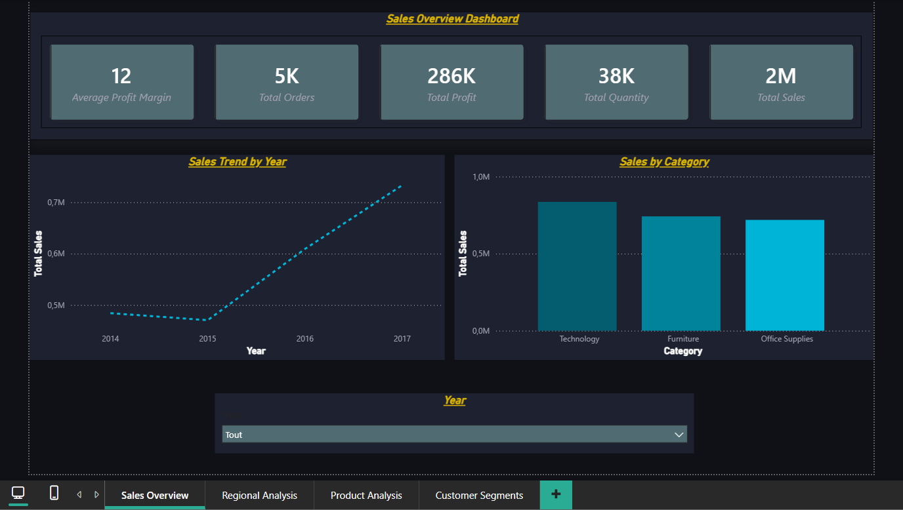
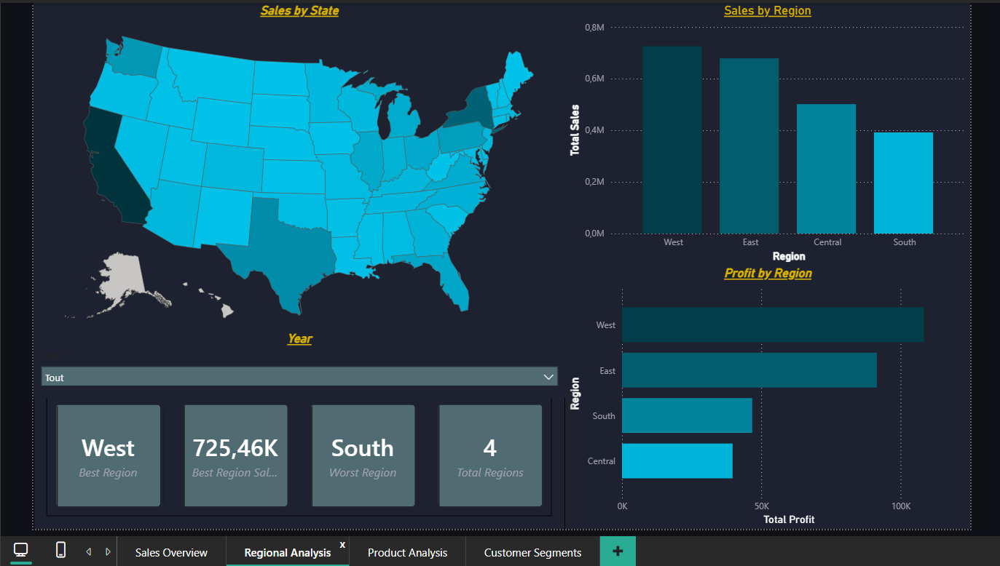
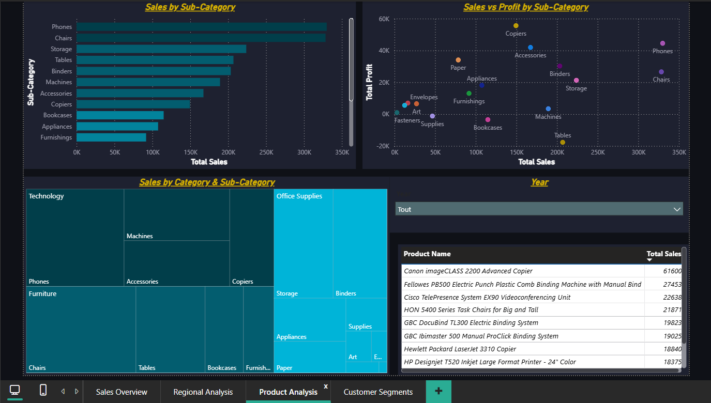
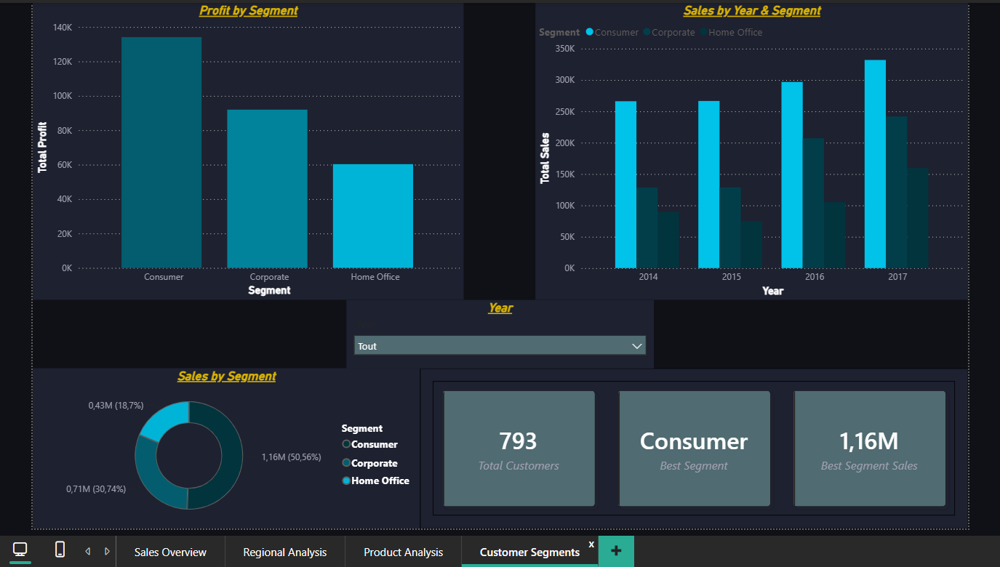

# 📊 Superstore Sales BI Dashboard

Interactive business intelligence dashboard built with Python and Power BI.

## 💡 What it does
Analyzes 4 years of retail sales data (2014–2017) across 4 interactive pages:
- **Sales Overview** — KPIs, revenue trend, category breakdown
- **Regional Analysis** — geographic performance map + region comparison
- **Product Analysis** — sub-category ranking, profitability scatter, top 10 products
- **Customer Segments** — Consumer vs Corporate vs Home Office analysis

## 🛠️ Tech Stack
- **Python (pandas)** — data cleaning and EDA
- **Power BI** — interactive dashboard

## 📸 Screenshots

### Sales Overview

### Regional Analysis

### Product Analysis

### Customer Segments

## 📁 Dataset
Superstore Sales Dataset — 9,994 orders, 21 columns

## 👤 Author
**Adam Benmoussa** — Engineering Student at ESITH Casablanca  
Specialized in Business & Data Management | BI & AI Automation
